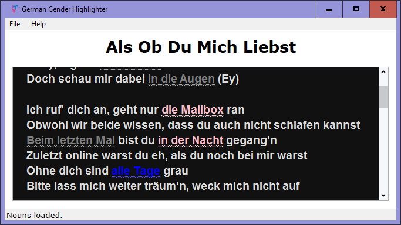

<h1 align="center">
  <b>German Gender Highlighter</b>
   
   
  
</h1>

<h2 align="center"><i>for german language learning noobs?</i></h2>

## About

Color-code German articles and prepositions based on gender of the noun they precede.

Take the output of this program with a grain of salt ...

<h1 align="center">
  </a>  

  <a href="https://girkovarpa.itch.io/german-gender-highlighter#download">
  👉 Download for Windows 👈</a>
</h1>
